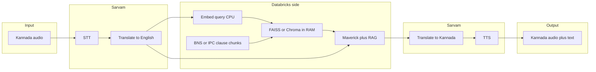

# Nyaya Dhwani: Multilingual Legal RAG App Plan

**Setup:** [README.md](../README.md) (Databricks CLI, `free-aws` profile, secrets, local `pytest`).  
This document is the **canonical plan**; keep it in sync with development.

---

## Current status

| Area | State |
|------|--------|
| **Repo layout** | `notebooks/`, `src/nyaya_dhwani/`, `tests/`, `pyproject.toml`, [`.gitignore`](../.gitignore) |
| **Ingestion** | [`notebooks/india_legal_policy_ingest.ipynb`](../notebooks/india_legal_policy_ingest.ipynb) in git — Delta tables under `main.india_legal`, including `legal_rag_corpus` |
| **Secrets** | Scope `nyaya-dhwani` (`datagov_api_key`, `sarvam_api_key`) or env vars — no keys committed |
| **Notebook fixes** | Sarvam cell syntax (`else` block), safe JSON error handling, corpus prefers `english_summary` for BNS rows |
| **Package** | [`text_utils`](../src/nyaya_dhwani/text_utils.py), [`manifest`](../src/nyaya_dhwani/manifest.py), [`embedder`](../src/nyaya_dhwani/embedder.py), [`index_builder`](../src/nyaya_dhwani/index_builder.py), [`retrieval`](../src/nyaya_dhwani/retrieval.py), [`sarvam_client`](../src/nyaya_dhwani/sarvam_client.py), [`llm_client`](../src/nyaya_dhwani/llm_client.py) |
| **RAG index** | [`notebooks/build_rag_index.ipynb`](../notebooks/build_rag_index.ipynb) writes FAISS + Parquet + `manifest.json` under `/Volumes/main/india_legal/legal_files/nyaya_index/` |
| **RAG smoke test** | `CorpusIndex.load` + `search` works in notebook when index + deps are installed |
| **App UI** | [`app/main.py`](../app/main.py) — Gradio **P0** (welcome, topics, chat); UI spec [UI_design.md](UI_design.md); deploy per [Deploy the app](#deploy-the-app-git-connected) |
| **Stack (locked)** | **Gradio** · **Databricks Llama 4 Maverick** (`databricks-llama-4-maverick`) via Playground **Get code** / **AI Gateway** env vars ([`llm_client.py`](../src/nyaya_dhwani/llm_client.py)) · **Sarvam** for STT/TTS/translate per [UI_design.md](UI_design.md) · **FAISS on UC Volume** for retrieval until Vector Search |
| **LLM** | [`llm_client.py`](../src/nyaya_dhwani/llm_client.py) — OpenAI-compatible chat; default model id **Maverick** — see [PLAYGROUND_TO_APP.md](PLAYGROUND_TO_APP.md) |
| **MLflow** | Optional tracing — not required for MVP (see §8 Step 1) |

---

## Recommended default (hackathon MVP)

**Target runtime:** a **[Databricks App](https://docs.databricks.com/en/dev-tools/databricks-apps/index.html)** built with **Gradio** (Python) in the same workspace as the data. **Generation** uses **Databricks Llama 4 Maverick** via **AI Gateway** / Playground **Get code** (same env vars as [`llm_client`](../src/nyaya_dhwani/llm_client.py)). Use **Unity Catalog / Volumes**, **Databricks Secrets** for Sarvam + LLM keys, and **shared `src/nyaya_dhwani`** importable from the App and from notebooks. **UI** follows [UI_design.md](UI_design.md) (screens, Sarvam pipeline, disclaimers).

**Why not vector search on a cluster per query?** On Free Edition, long-lived Spark clusters for interactive FAISS/Chroma are costly. Prefer: **offline index build** (notebook or job) → **persist** FAISS/Chroma + manifest to a **UC Volume** → **load in memory** in the App container at startup.

If **Databricks Apps** are unavailable on the SKU, use a **notebook** with file upload and the same Python modules, or a **job** that runs the pipeline (higher latency).

### Deploy the app (Git-connected)

Use the workspace wizard to deploy this repo as a [Databricks App](https://docs.databricks.com/en/dev-tools/databricks-apps/index.html). Exact labels vary slightly by UI version; the flow is:

1. **Compute → Apps → Create** (or **Create app** from the Apps list).
2. **Name** the app (e.g. `nyaya-dhwani`).
3. **Connect this Git repository** — point at the same Git remote as the hackathon repo (clone via **Databricks Repos** first, or connect GitHub/GitLab with OAuth or PAT per [WORKSPACE_SETUP.md](WORKSPACE_SETUP.md)); choose branch (e.g. `main`).
4. **Configure the app**
   - **Start command** — declared in repo-root [`app.yaml`](../app.yaml) as `python app/main.py` (Databricks default without `app.yaml` is `python app.py`, which does not exist in this repo).
   - **Dependencies** — repo-root [`requirements.txt`](../requirements.txt) pins the stack via `pip install -e ".[rag,rag_embed,app]"` (`faiss-cpu` 1.7.x, `numpy<2`, `sentence-transformers`, `gradio`, etc.).
   - **Working directory** — usually repo root so `src/nyaya_dhwani` is importable; set explicitly if your layout differs.
   - **Environment variables / secrets** — no keys in git. Map the same variables as [PLAYGROUND_TO_APP.md](PLAYGROUND_TO_APP.md): `DATABRICKS_TOKEN` (or `LLM_API_KEY`), `LLM_OPENAI_BASE_URL`, `LLM_MODEL=databricks-llama-4-maverick`, `SARVAM_API_KEY` (from scope `nyaya-dhwani` / `sarvam_api_key` or direct App env). Optionally `NYAYA_INDEX_DIR` if the app reads index path from env (default: notebook output path below).
   - **Unity Catalog** — grant the App’s service principal (or identity) **read** on the Volume folder containing the index, e.g. `/Volumes/main/india_legal/legal_files/nyaya_index/`.

**Prerequisites before deploy:** §8 Step **0** (ingest + `build_rag_index`) complete; Step **2** (LLM **Get code** with Maverick) works in a notebook; Step **4** (Apps) available; secrets populated.

---

## 1. Align ingestion with retrieval

**Canonical notebook:** [`notebooks/india_legal_policy_ingest.ipynb`](../notebooks/india_legal_policy_ingest.ipynb) (workspace copy may still exist [here](https://dbc-6651e87a-25a5.cloud.databricks.com/editor/notebooks/3612872385018180?o=7474650313055161#command/7489865991491179); **git is source of truth**).

The notebook already materializes **`main.india_legal.legal_rag_corpus`** with columns such as `chunk_id`, `source`, `doc_type`, `title`, `text` (BNS, mapping, schemes). For RAG you still need:

| Artifact | Purpose |
|----------|---------|
| **Embeddings** | Same model at ingest and query (e.g. `sentence-transformers` id or API embedding id) |
| **Vector index** | FAISS + id mapping, or Chroma persist dir, **plus** optional Parquet of chunk metadata |
| **Manifest** | `manifest.json`: model id, embedding dim, UC path to index, schema version, timestamp |

**Action:** Add a notebook section (or job) that reads `legal_rag_corpus`, embeds `text` (or `english_summary` when present), writes index + manifest under e.g. `/Volumes/main/india_legal/legal_files/nyaya_index/` (or dedicated Volume).

---

## 2. Query path (runtime)

1. **Sarvam (inbound)** — STT + translate to English per [Sarvam docs](https://docs.sarvam.ai) and the pipeline in [UI_design.md](UI_design.md) (`saaras-v2`, `mayura` as needed); output `query_en`.
2. **Embed** `query_en` with the **same** model as ingestion (`SentenceEmbedder` / notebook).
3. **Retrieve** — `CorpusIndex.search` over FAISS built from Volume path (default index dir: `/Volumes/main/india_legal/legal_files/nyaya_index/`); top-k + optional MMR / score floor.
4. **LLM** — **Databricks Llama 4 Maverick** via `llm_client.chat_completions`: system + user messages include retrieved chunk text, citation hints, and a **not legal advice** disclaimer ([UI_design.md](UI_design.md) mandatory disclaimers). Keys via Secrets / env per [PLAYGROUND_TO_APP.md](PLAYGROUND_TO_APP.md).
5. **Sarvam (outbound)** — translate answer to user language if needed (`mayura`); **TTS** (`bulbul-v1`) for audio; return Markdown text + optional audio bytes to Gradio.

### App runtime (Gradio + Volume)

- **Cold start:** At process start (or first request), load `CorpusIndex` + embedder from the Volume path (same as [build_rag_index.ipynb](../notebooks/build_rag_index.ipynb)); expect tens of seconds on first load.
- **Inbound:** Text queries go straight to embed → retrieve. Voice: Gradio `Audio` → Sarvam STT → same pipeline as [UI_design.md](UI_design.md) “Sarvam API Pipeline”.
- **Outbound:** Append disclaimer to every assistant message in UI; optional TTS and `gr.Audio` per design spec.

### UI implementation vs [UI_design.md](UI_design.md)

Full spec has six screens. Implement in priority order:

| Priority | Screens (from UI_design) | Notes |
|----------|--------------------------|--------|
| **P0** | Welcome + language; Chat + topic chips; response with disclaimer + citations | Core text RAG loop in Gradio |
| **P1** | Voice (Screens 03–04): mic, STT, TTS | Depends on Sarvam in the App runtime |
| **P2** | Settings (Screen 06) | Session prefs, TTS toggles |
| **P3** | Lawyer Connect (Screen 05) | External directory/APIs; can be stub |

---

## 3. Repository layout

| Path | Status |
|------|--------|
| `notebooks/india_legal_policy_ingest.ipynb` | Done — ingestion + `legal_rag_corpus` |
| `src/nyaya_dhwani/text_utils.py` | Done |
| `sarvam_client.py`, `embedder.py`, `index_builder.py`, `retrieval.py`, `manifest.py` | Done |
| `llm_client.py` | Done — OpenAI-compatible chat; Maverick via env; see [PLAYGROUND_TO_APP.md](PLAYGROUND_TO_APP.md) |
| `pipeline.py` | Planned — optional orchestration (retrieve + Sarvam + LLM) |
| `app/main.py` | **Done** — Gradio `Blocks` (P0); theme/CSS per [UI_design.md](UI_design.md) §Design Language |
| `requirements.txt` | **Done** — Databricks Apps `pip install -r requirements.txt` (same pins as `requirements-app.txt`) |
| `app.yaml` | **Done** — `command: [python, app/main.py]` (overrides default `python app.py`) |
| `databricks.yml` | Optional — Asset Bundle |
| `tests/` | Done for helpers; extend when RAG modules exist |

---

## 4. Security and compliance

- **Secrets:** `sarvam_api_key`, `datagov_api_key`, future `LLM_API_KEY` in scope `nyaya-dhwani` (or equivalent env vars). Never commit secrets.
- **Disclaimer:** UI + system prompt — informational only, not a substitute for professional legal advice.
- **PII / logging:** Avoid logging raw audio; prefer lengths or hashes.

---

## 5. Free Edition constraints

- Prefer **App CPU** + **Volume-backed index** over always-on clusters for **inference**.
- Run **ingestion / embedding jobs** on short-lived cluster or serverless when supported.
- Expect **cold start** when loading FAISS in the App; optional warmup route.

---

## 6. Phases

| Phase | Scope |
|-------|--------|
| **MVP** | Text-in English query → retrieve → **Maverick** answer (no audio). Optional **MLflow** trace. |
| **MVP+ (current target)** | **Databricks App (Gradio)** from **Git** + **AI Gateway** / Playground env for **Maverick** + **FAISS** Volume + [UI_design.md](UI_design.md) **P0** |
| **MVP++** | **Sarvam** STT/TTS + multilingual; [UI_design.md](UI_design.md) **P1** voice flow |
| **v2** | Full Settings / Lawyer Connect ([UI_design.md](UI_design.md) **P2–P3**); streaming UI; Sarvam rate limits |
| **v3** | Optional **Databricks Vector Search** if SKU/cost allow |

---

## 7. Technical choices

- **FAISS vs Chroma:** FAISS is lean; Chroma helps metadata filters (`source`, `doc_type`).
- **LLM:** **Databricks Llama 4 Maverick** (`databricks-llama-4-maverick`) as default; abstract behind `llm_client` for provider swaps if Playground model ids change.
- **UI:** **Gradio** only for the shipped app; FastAPI is optional for a future thin API.

---

## 8. Build sequence — verify *your* workspace (small pieces)

Do these **in order**. After each step, **note pass / fail** (and any error text). That tells us whether to target **notebook-only**, **Databricks Apps**, **Model Serving**, **AI Gateway**, or **external LLM + MLflow tracing** for your SKU.

### Step 0 — Already done if you followed the repo

| # | Try | Pass criteria |
|---|-----|----------------|
| 0a | Run [`notebooks/india_legal_policy_ingest.ipynb`](../notebooks/india_legal_policy_ingest.ipynb) through `legal_rag_corpus` | `SELECT COUNT(*) FROM main.india_legal.legal_rag_corpus` > 0 |
| 0b | Run [`notebooks/build_rag_index.ipynb`](../notebooks/build_rag_index.ipynb) through index write + smoke cell | `nyaya_index/` contains `corpus.faiss`, `chunks.parquet`, `manifest.json`; `ci.search` returns rows |

**If 0b failed:** fix deps (`faiss-cpu` 1.7.x, `numpy<2`, lazy `get_faiss`) per README — do not start the app layer until search works.

---

### Step 1 — MLflow UI (low risk)

| # | Try | Pass criteria |
|---|-----|----------------|
| 1a | Sidebar: **Machine Learning** → **Experiments** (or **Experiments** in workspace) | UI opens; you can create an experiment, e.g. `/Shared/nyaya-dhwani` |
| 1b | In any notebook: `import mlflow; mlflow.set_experiment("/Shared/nyaya-dhwani"); mlflow.start_run(); mlflow.log_param("probe", 1); mlflow.end_run()` | Run succeeds; run appears in UI |

**If 1b fails:** note the error (MLflow not on cluster / serverless). We can skip MLflow for MVP and add it when compute allows.

---

### Step 2 — Hosted LLM in the workspace (pick what your UI offers)

Product names change; use whatever your workspace lists under **AI/ML**, **Serving**, **Playground**, or **Foundation Model APIs**.

| # | Try | Pass criteria |
|---|-----|----------------|
| 2a | Open **Playground** or **Chat** against a **Databricks-managed** or **external** model | You get one completion without writing an App |
| 2b | In a notebook, run the **smallest documented example** for workspace LLM access (often via `databricks-*` SDK or REST). *Do not commit API output.* | One programmatic completion works |

**Default for this repo:** Select **Databricks Llama 4 Maverick** in Playground, then **Get code** — same pattern as post-retrieval generation. Other models (e.g. Gemma 3 12B, Llama 3.1 8B Instruct) also work for smoke tests. Use **Get code** → notebook → env vars per [PLAYGROUND_TO_APP.md](PLAYGROUND_TO_APP.md) (`LLM_MODEL=databricks-llama-4-maverick`).

**Report back:** endpoint type (OpenAI-compatible URL, AI Gateway `…/mlflow/v1`, etc.).

**If 2a–2b fail:** MVP can use **external** OpenAI-compatible API with key in **`nyaya-dhwani`** scope (e.g. `openai_api_key`) — same RAG code, different `llm_client` backend.

---

### Step 3 — AI Gateway / governed routing (optional)

| # | Try | Pass criteria |
|---|-----|----------------|
| 3a | Search workspace docs or sidebar for **AI Gateway**, **Inference**, **External models** | You see a way to register or route models |
| 3b | If available, route **one** model through the gateway and call it from a notebook using the **documented** client | Same as 2b, but URL/key pattern is gateway-specific |

**If unavailable:** implement `llm_client` with direct provider first; add gateway later.

---

### Step 4 — Databricks Apps (required for MVP+ Gradio deploy)

| # | Try | Pass criteria |
|---|-----|----------------|
| 4a | Sidebar: **Compute → Apps** (or **Apps**) | **Create app** / **Create** is visible |
| 4b | Deploy a **hello-world** **Gradio** sample from [Databricks Apps docs](https://docs.databricks.com/en/dev-tools/databricks-apps/index.html) | App status **Running**; URL loads in browser |
| 4c | **Create** a second app from **this Git repo** (wizard: name → repository → configure) per [Deploy the app](#deploy-the-app-git-connected) | Same pass criteria — proves Git-connected path |

**If 4a fails:** ship **MVP in a notebook** (text box + `display` + RAG function) or a **job** that answers batch queries — still valid for the hackathon.

---

### Step 5 — Code we add in repo

| You confirmed | We add (repo) |
|---------------|----------------|
| Step 2 works | Already have `llm_client.py`; set env for **Maverick** ([PLAYGROUND_TO_APP.md](PLAYGROUND_TO_APP.md)) |
| Step 1 works | Optional `mlflow.trace` / autolog around retrieve + LLM |
| Step 4 works | `app/main.py` — **Gradio** `Blocks` [UI_design.md](UI_design.md) **P0** (in repo); optional `pipeline.py` refactor |
| Only Step 0 | Notebook template cell: `def ask(q): ...` using `CorpusIndex` + placeholder LLM |

**Nothing here requires Vector Search** — FAISS on Volume is enough until you outgrow it.

---

## 9. Vector Search and Apps on Free Edition (you have both)

If **Compute → Vector Search** and **Compute → Apps → Create app** are visible (as in your workspace), you **can** use them. They solve different layers than the current FAISS notebook pipeline.

### Databricks Apps — use for the “real” HTTP app

| Role | Notes |
|------|--------|
| **What** | Host a **Gradio** app in the workspace (Git-connected deploy per [Deploy the app](#deploy-the-app-git-connected)). |
| **Fit** | **Load `CorpusIndex` from the Volume path** at startup (same as the notebook); Gradio handlers call embed → FAISS search → **Maverick** → Markdown + optional TTS. |
| **Secrets** | `DATABRICKS_TOKEN` / `LLM_*` + `SARVAM_API_KEY` via **Secrets** or App env — no keys in git. |
| **Next repo step** | **P1:** Sarvam STT/TTS in `app/main.py`; optional `app.yaml` per [Databricks Apps docs](https://docs.databricks.com/en/dev-tools/databricks-apps/index.html). |

**Recommendation:** Ship **MVP retrieval + LLM inside an App** once `llm_client` exists; keep FAISS on Volume first — no Vector Search required.

### Databricks Vector Search — optional upgrade path

| Role | Notes |
|------|--------|
| **What** | **Managed** vector index over a **Delta** source table, with workspace-managed embedding or your model, **query APIs** without holding FAISS in memory. |
| **vs FAISS** | You already have **`legal_rag_corpus`** + offline **FAISS + Parquet** on a Volume. Vector Search is an **alternate** retrieval backend: create an index **synced from** `main.india_legal.legal_rag_corpus` (or a filtered view), point at the same `text` column, choose an embedding endpoint consistent with your app. |
| **Pros** | No large FAISS load in the App container; scaling and ops are Databricks-managed; filters in UI/API. |
| **Cons** | Extra setup, embedding **must** match or you re-embed; cost/limits depend on SKU. |
| **When** | After MVP works: **migrate** or **dual-run** (A/B) if FAISS cold start or size becomes painful. |

### AI Gateway (sidebar)

Use **AI Gateway** to route **LLM** calls (generation after retrieve), not to replace **sentence-transformers** embeddings unless you switch to a **hosted embedding** model and re-index.

---

## 10. Developer setup (Databricks Free Edition)

Use this checklist to install and run the app from this repo in a **Free Edition**–style workspace:

1. **Auth** — [README.md](../README.md): Databricks CLI, profile (e.g. `free-aws`), `export DATABRICKS_CONFIG_PROFILE=...` as needed.
2. **One-time integration** — [WORKSPACE_SETUP.md](WORKSPACE_SETUP.md): add the repo under **Repos**, secret scope `nyaya-dhwani` (`sarvam_api_key`, etc.).
3. **Data + index** — Run [`india_legal_policy_ingest.ipynb`](../notebooks/india_legal_policy_ingest.ipynb) and [`build_rag_index.ipynb`](../notebooks/build_rag_index.ipynb); confirm `/Volumes/main/india_legal/legal_files/nyaya_index/` contains `corpus.faiss`, `chunks.parquet`, `manifest.json`.
4. **LLM env** — In Playground, select **Llama 4 Maverick**, **Get code**, map to `LLM_OPENAI_BASE_URL`, `LLM_MODEL`, `DATABRICKS_TOKEN` per [PLAYGROUND_TO_APP.md](PLAYGROUND_TO_APP.md).
5. **Deploy** — **Compute → Apps → Create** → name → **Git repository** → configure start command, env, Volume **read** for the app identity ([Deploy the app](#deploy-the-app-git-connected)).
6. **Verify** — Open the App URL; check logs for import errors, missing `SARVAM_API_KEY`, or permission denied on the Volume.

**Limitations:** Expect **cold start** (FAISS + embedder load). Free Edition SKUs may cap App size or features; if **Apps** is unavailable, use a **notebook** UI with the same `nyaya_dhwani` imports until the SKU allows Apps.

---

## 11. End-user instructions

For people who only **use** the deployed app (not developers):

1. Open the **app URL** your workspace admin shares (Databricks App link).
2. On the **welcome** screen, choose your **language** and read the short disclaimer — the assistant is for general information, not a substitute for a lawyer.
3. On **Chat**, type a legal question or use **topic chips** to start from a common topic (tenant rights, consumer cases, etc.).
4. Read the **answer** and any **citation** tags (Acts/sections from retrieved context). Every reply includes a **disclaimer** that the information is not legal advice.
5. If **voice** is available: use the microphone to speak; listen to **TTS** playback when offered. You can change language or settings when those screens are enabled.
6. For **professional help**, use **Find a Lawyer** (when implemented) or seek a qualified advocate; Nyaya Dhwani does not replace the Bar Council–registered counsel.

---

## Summary

**Done:** Ingestion notebook, Delta corpus, FAISS index + manifest on Volume, `nyaya_dhwani` retrieval + embedder, lazy FAISS import, Parquet-safe chunks, `llm_client` (Maverick-ready), Playground + MLflow probes, **Gradio hello-world on Databricks Apps**.  
**Next:** **Git-connected** App deploy from `main`; Volume **read** for `nyaya_index`; App env for `DATABRICKS_TOKEN`, `LLM_*`, and `SARVAM_API_KEY` for STT / Mayura / Bulbul in [`app/main.py`](../app/main.py). **Vector Search** remains optional.

---

## Verification checklist (legacy)

- [x] `SHOW TABLES IN main.india_legal` after ingestion
- [x] Sample `SELECT` on `legal_rag_corpus` with filters on `source`
- [ ] `python3 -m pytest tests/ -q` locally
- [x] After RAG build: index files + `manifest.json` on Volume; notebook `CorpusIndex.search` smoke query
- [x] §8 Step 1 — MLflow experiment log from notebook *(example workspace)*
- [x] §8 Step 2 — Playground LLM + **Get code** path *(example workspace)*
- [x] §8 Step 4 — Databricks App **Gradio** hello-world **Running** *(example workspace)*
- [ ] §8 Step 4c — **Git-connected** app from this repo **Running** (after `app/main.py` exists)

Template for *your* workspace: copy the rows above and uncheck until done.
